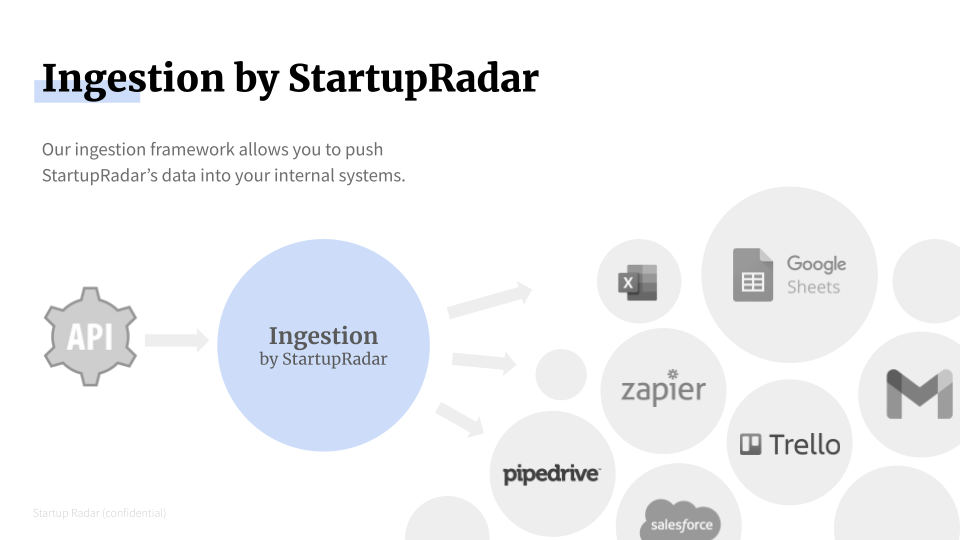

# Ingestion framework for StartupRadar

This repository provides a framework to ingest [StartupRadar](https://startupradar.co) data into your own systems.
Adaption to most use cases should be possible with only a few lines of code.

What Ingestion does for you:

- fetches new startups from our [startup API](https://api.startupradar.co/api) through a variety of methods
- compares all startups against already stored startups
- creates new deals or updates existing ones

With this tool, you can easily implement the following use cases:
 
- create a new CRM deal for every unseen startup on StartupRadar
- create a new comment for every competitor to a portfolio startup
- add a comment on every deal that gets mentioned in the news

## Supported Backends
Backends are the places where existing deals can be found and where new deals can get stored.
So if a new startup pops up, this is where it's stored.

File-based:

- CSV: a CSV file with a row for each startup

CRMs (coming soon):

- Pipedrive
- Hubspot
- Affinity
- Salesforce
- Attio

Others (coming soon):

- Airtable: check against and push new rows to airtable
- Slack: push new startups as slack messages
- Asana: add a task for each new startup
- Trello: add a card for each new startup

Implementing your own storage backend is possible as well.

## How new startups can be discovered
This tool provides easy access to the API and its features.
New startups can currently be discovered in two ways.
Firstly, via the Discovery endpoints of the API.
These endpoints provide daily fresh discoveries, e.g. startups from academia or startups in the press.
Secondly, by checking similar startups for a given list of startups, 
e.g. going through all your existing deals and adding newly discovered, related startups,
or by going through your portfolio and adding similar startups.

## Installation and usage
- install by cloning this repository
- create a virtual environment and activate it
- install its requirements: `pip install -r requirements.txt`
- edit the config.py file to match your desired workflow

## Changelog

### 2022-12-17
- initial publication